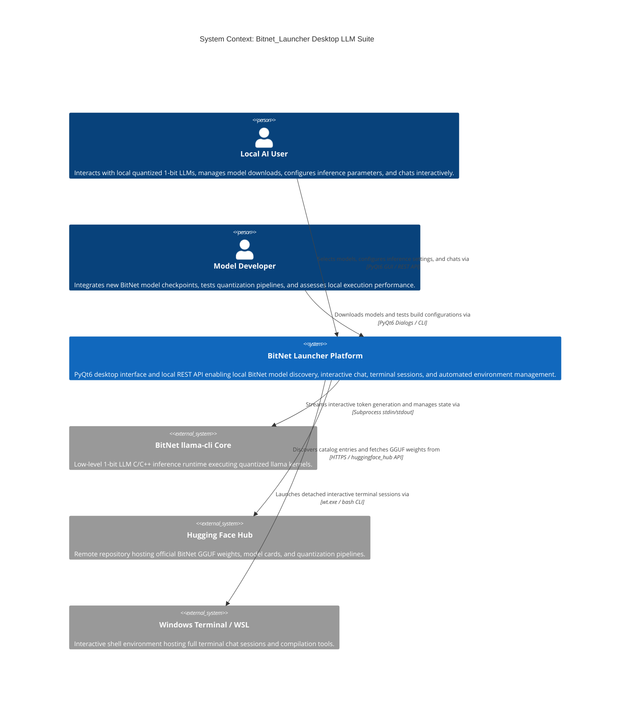
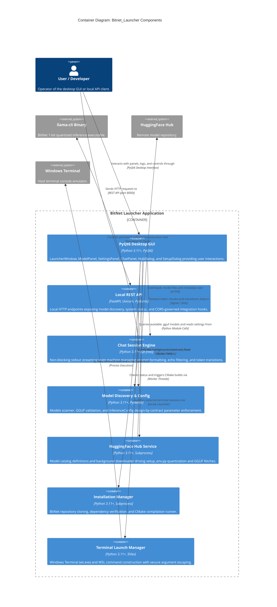

# Bitnet_Launcher Architecture Map

## 1. System Context View (C4Context)

## 2. Container View (C4Container)

## Feature Map

| Capability | Component | Interface | Evidence |
| --- | --- | --- | --- |
| Model Discovery & Validation | Model Manager (`src/bitnet_launcher/models.py`) | Python API (`discover_models`, `ModelInfo`) | `tests/unit/test_models.py` |
| Inference Settings & Contracts | Config (`src/bitnet_launcher/config.py`) | Dataclasses (`InferenceConfig`, `BitnetConfig`) | `tests/unit/test_config.py` |
| Persistent Chat State Machine | Chat Engine (`src/bitnet_launcher/chat_session.py`) | Pure Python State Machine (`ChatSession`) | `tests/unit/test_chat_session.py` |
| Model Hub Catalog & Download | Hub Service (`src/bitnet_launcher/hub.py`) | Python API (`download_model`, `HubModel`) | `tests/unit/test_hub.py`, `tests/unit/test_hub_download.py` |
| Installation & CMake Build | Installer (`src/bitnet_launcher/installer.py`) | Python API (`check_installation`, `install_bitnet`) | `tests/unit/test_installer.py`, `tests/unit/test_installer_subprocess.py` |
| Terminal Launch Integration | Terminal Manager (`src/bitnet_launcher/terminal.py`) | Python API (`launch_terminal`, `build_command`) | `tests/unit/test_terminal.py` |
| Desktop GUI Workflow | GUI Layer (`src/bitnet_launcher/gui/`) | PyQt6 Widgets (`LauncherWindow`, Panels, Dialogs) | `tests/unit/test_app.py` |
| Local REST API & Auth | API Layer (`src/bitnet_launcher/api.py`) | FastAPI Endpoints (`/models`, `/health`) | `tests/unit/test_api.py`, `tests/unit/test_api_auth.py`, `tests/unit/test_api_cors.py` |

## Architecture Change Log

| Date | PR / Issue | Description |
| --- | --- | --- |
| 2026-09-10 | #1596 | Baseline adoption of maintainable Mermaid C4 architecture maps (C4Context, C4Container, Feature Map, Change Log) |
